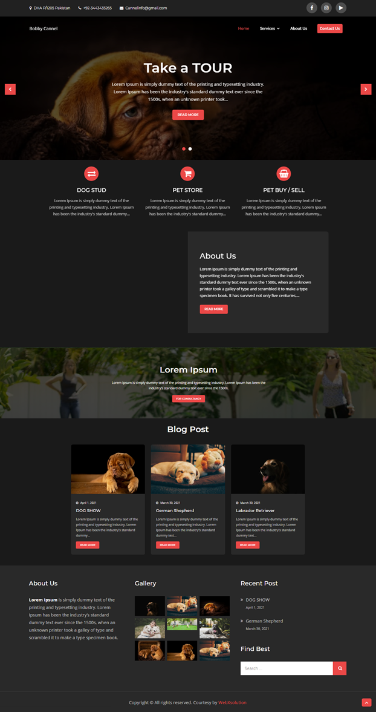
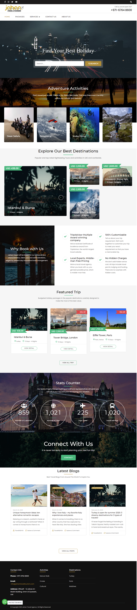
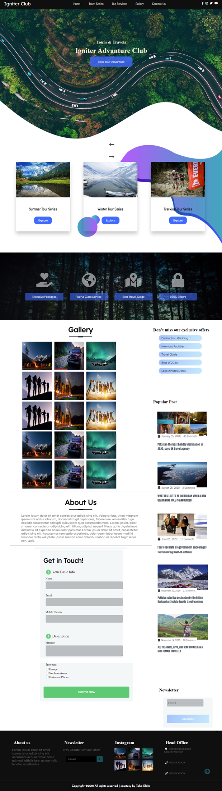
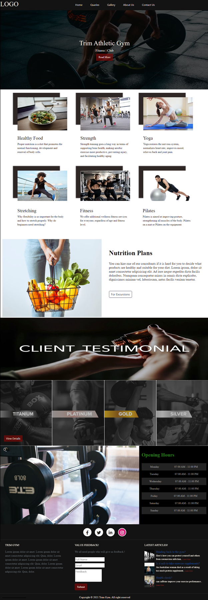

<!DOCTYPE html>
<html lang="en">

<head>
    <meta charset="UTF-8">
    <meta http-equiv="X-UA-Compatible" content="IE=edge">
    <meta name="viewport" content="width=device-width, initial-scale=1.0">
    <title>Taha Portfolio</title>
    <!-- Favicons -->
    <link href="assets/img/icon.png" rel="icon">

    <!-- Google Fonts -->
    <link
        href="https://fonts.googleapis.com/css?family=Open+Sans:300,300i,400,400i,600,600i,700,700i|Raleway:300,300i,400,400i,500,500i,600,600i,700,700i|Poppins:300,300i,400,400i,500,500i,600,600i,700,700i"
        rel="stylesheet">

    <!-- Vendor CSS Files -->
    <link href="assets/css/bootstrap/css/bootstrap.min.css" rel="stylesheet">

    <link href="assets/css/owl.carousel/assets/owl.carousel.min.css" rel="stylesheet">
    <link href="assets/css/aos/aos.css" rel="stylesheet">

    <!-- social icons -->
    <link rel="stylesheet" href="https://pro.fontawesome.com/releases/v5.10.0/css/all.css"
        integrity="sha384-AYmEC3Yw5cVb3ZcuHtOA93w35dYTsvhLPVnYs9eStHfGJvOvKxVfELGroGkvsg+p" crossorigin="anonymous" />

    <!-- Template Main CSS File -->
    <link href="assets/css/style.css" rel="stylesheet">
</head>

<body>
    

        

    

    <!-- === Mobile nav toggle ==== -->
    <button type="button" class="mobile-nav-toggle d-xl-none"><i class="icofont-navigation-menu"></i></button>

    <!-- ======= Header ======= -->
    <header id="header">
        

            

                
                <h1 class="text-light"><a href="index.php">Taha Elahi</a></h1>
            

            <nav class="nav-menu">
                <ul>
                    <li class="active"><a href="#hero"><i class="fas fa-home"></i> Home</a></li>
                    <li><a href="#about"><i class="fas fa-user"></i> About</a></li>
                    <li><a href="#portfolio"><i class="fas fa-book"></i> Portfolio</a></li>
                    <li><a href="#services"><i class="fas fa-server"></i> Services</a></li>
                    <li><a href="#contact"><i class="fas fa-envelope"></i> Contact</a></li>

                </ul>
            </nav><!-- .nav-menu -->
            <button type="button" class="mobile-nav-toggle d-xl-none"><i class="fas fa-bars"></i></button>

        

    </header><!-- End Header -->

    <!-- ==== Hero Section ==== -->
    <section id="hero" class="d-flex flex-column justify-content-center align-items-center">
        <!-- <video controls autoplay src="assets/img/bg-cover.mp4"></video> -->
        

            <h1>Taha Elahi</h1>
            
I'm 

        

    </section>
    <!-- End Hero -->

    <main id="main">

        <!-- ======= About Section ======= -->
        <section id="about" class="about">
            

                

                    <h2>About</h2>
                    
I'm Taha ELahi - a front-end web developer. Create high performance & rich interactive websites
                        that work across all platforms & devices. Although I'm very familiar with using frameworks, my
                        websites are primarily hand-coded using HTML5, CSS3 & JavaScript. With a strong emphasis on
                        "Progressive Enhancement", I look for creative ways to push the boundaries of website front-end
                        code without compromising on browser support and performance. I strive to make the web a
                        beautiful place.

                

                

                    

                        
                    

                    

                        <h3>SEO Specialist &amp; Web Developer.</h3>
                        

                            I'm a Web Developer from Karachi. I enjoy building everything from business sites to rich
                            interactive Websites. If you are a business seeking a web presence or an employer looking to
                            hire, you can get in touch with me here.
                        

                            

                                <ul>
                                    <li><i class="icofont-rounded-right"></i> <strong>Phone:</strong> +92344-3435265
                                    </li>
                                    <li><i class="icofont-rounded-right"></i> <strong>Country:</strong> Pakistan</li>
                                </ul>
                            

                            

                                <ul>
                                    <li><i class="icofont-rounded-right"></i> <strong>Email:</strong>
                                        tahaelahi05@gmail.com
                                    </li>
                                    <li><i class="icofont-rounded-right"></i> <strong>Freelance:</strong> Available</li>
                                </ul>
                            

                        

                    

                

            

        </section><!-- End About Section -->

        <!-- ======= Skills Section ======= -->
        <section id="skills" class="skills section-bg">
            

                

                    <h2>Skills</h2>
                    
Magnam dolores commodi suscipit. Necessitatibus eius consequatur ex aliquid fuga eum quidem. Sit
                        sint
                        consectetur velit. Quisquam quos quisquam cupiditate. Et nemo qui impedit suscipit alias ea.
                        Quia
                        fugiat sit in iste officiis commodi quidem hic quas.

                

                

                    

                        

                            HTML <i class="val">100%</i>
                            

                                

                            

                        

                        

                            CSS <i class="val">90%</i>
                            

                                

                            

                        

                        

                            JavaScript <i class="val">70%</i>
                            

                                

                            

                        

                    

                    

                        

                            php<i class="val">80%</i>
                            

                                

                            

                        

                        

                            Wordpress <i class="val">100%</i>
                            

                                

                            

                        

                        

                            SEO<i class="val">90%</i>
                            

                                

                            

                        

                    

                

            

        </section><!-- End Skills Section -->

        <!-- ======= Portfolio Section ======= -->
        <section id="portfolio" class="portfolio section-bg">
            

                

                    <h2>Portfolio</h2>
                    
Magnam dolores commodi suscipit. Necessitatibus eius consequatur ex aliquid fuga eum quidem. Sit
                        sint
                        consectetur velit. Quisquam quos quisquam cupiditate. Et nemo qui impedit suscipit alias ea.
                        Quia
                        fugiat sit in iste officiis commodi quidem hic quas.

                

                

                    

                        <ul id="portfolio-flters">
                            <li data-filter="*" class="filter-active">All</li>
                            <li data-filter=".filter-web">Web</li>
                        </ul>
                    

                

                

                    

                        

                            
                            

                                <a href="assets/img/portfolio/BobbyCannel.png" data-gall="portfolioGallery"
                                    title="Web 3"><i class="fas fa-plus"></i></a>
                                <a href="portfolio-details.html" title="More Details"><i class="fas fa-link"></i></a>
                            

                        

                    

                    

                        

                            
                            

                                <a href="assets/img/portfolio/JahanTravel.png" data-gall="portfolioGallery"
                                    title="App 2"><i class="fas fa-plus"></i></a>
                                <a href="portfolio-details.html" title="More Details"><i class="fas fa-link"></i></a>
                            

                        

                    

                    

                        

                            
                            

                                <a href="assets/img/portfolio/Igniter.png" data-gall="portfolioGallery" title="Web 2"><i
                                        class="fas fa-plus"></i></a>
                                <a href="portfolio-details.html" title="More Details"><i class="fas fa-link"></i></a>
                            

                        

                    

                    

                        

                            
                            

                                <a href="assets/img/portfolio/TrimGym.png" data-gall="portfolioGallery" title="Web 3"><i
                                        class="fas fa-plus"></i></a>
                                <a href="portfolio-details.html" title="More Details"><i class="fas fa-link"></i></a>
                            

                        

                    

                

            

        </section>
        <!-- End Portfolio Section -->

        <!-- ======= Services Section ======= -->
        <section id="services" class="services">
            

                

                    <h2>Services</h2>
                    
Magnam dolores commodi suscipit. Necessitatibus eius consequatur ex aliquid fuga eum quidem. Sit
                        sint
                        consectetur velit. Quisquam quos quisquam cupiditate. Et nemo qui impedit suscipit alias ea.
                        Quia
                        fugiat sit in iste officiis commodi quidem hic quas.

                

                

                    

                        
<i class="fas fa-desktop"></i>

                        <h4 class="title"><a href="">Lorem Ipsum</a></h4>
                        
Voluptatum deleniti atque corrupti quos dolores et quas molestias
                            excepturi
                            sint occaecati cupiditate non provident

                    

                    

                        
<i class="fas fa-chart-bar"></i>

                        <h4 class="title"><a href="">Dolor Sitema</a></h4>
                        
Minim veniam, quis nostrud exercitation ullamco laboris nisi ut aliquip
                            ex ea
                            commodo consequat tarad limino ata

                    

                    

                        
<i class="fas fa-globe-americas"></i>

                        <h4 class="title"><a href="">Sed ut perspiciatis</a></h4>
                        
Duis aute irure dolor in reprehenderit in voluptate velit esse cillum
                            dolore
                            eu fugiat nulla pariatur

                    

                    

                        
<i class="fas fa-image"></i>

                        <h4 class="title"><a href="">Magni Dolores</a></h4>
                        
Excepteur sint occaecat cupidatat non proident, sunt in culpa qui officia
                            deserunt mollit anim id est laborum

                    

                    

                        
<i class="fas fa-sliders-h"></i>

                        <h4 class="title"><a href="">Nemo Enim</a></h4>
                        
At vero eos et accusamus et iusto odio dignissimos ducimus qui blanditiis
                            praesentium voluptatum deleniti atque

                    

                    

                        
<i class="fas fa-calendar-alt"></i>

                        <h4 class="title"><a href="">Eiusmod Tempor</a></h4>
                        
Et harum quidem rerum facilis est et expedita distinctio. Nam libero
                            tempore,
                            cum soluta nobis est eligendi

                    

                

            

        </section><!-- End Services Section -->

        <!-- ======= Testimonials Section ======= -->
        <section id="testimonials" class="testimonials section-bg">
            

                

                    <h2>Testimonials</h2>
                    
Magnam dolores commodi suscipit. Necessitatibus eius consequatur ex aliquid fuga eum quidem. Sit
                        sint
                        consectetur velit. Quisquam quos quisquam cupiditate. Et nemo qui impedit suscipit alias ea.
                        Quia
                        fugiat sit in iste officiis commodi quidem hic quas.

                

                

                    

                        

                            <i class="fas fa-quote-left quote-icon-left"></i>
                            Proin iaculis purus consequat sem cure digni ssim donec porttitora entum suscipit rhoncus.
                            Accusantium quam, ultricies eget id, aliquam eget nibh et. Maecen aliquam, risus at semper.
                            <i class="fas fa-quote-right quote-icon-right"></i>
                        

                        
                        <h3>Saul Goodman</h3>
                        <h4>Ceo &amp; Founder</h4>
                    

                    

                        

                            <i class="fas fa-quote-left quote-icon-left"></i>
                            Export tempor illum tamen malis malis eram quae irure esse labore quem cillum quid cillum
                            eram
                            malis quorum velit fore eram velit sunt aliqua noster fugiat irure amet legam anim culpa.
                            <i class="fas fa-quote-right quote-icon-right"></i>
                        

                        
                        <h3>Sara Wilsson</h3>
                        <h4>Designer</h4>
                    

                    

                        

                            <i class="fas fa-quote-left quote-icon-left"></i>
                            Enim nisi quem export duis labore cillum quae magna enim sint quorum nulla quem veniam duis
                            minim tempor labore quem eram duis noster aute amet eram fore quis sint minim.
                            <i class="fas fa-quote-right quote-icon-right"></i>
                        

                        
                        <h3>Jena Karlis</h3>
                        <h4>Store Owner</h4>
                    

                    

                        

                            <i class="fas fa-quote-left quote-icon-left"></i>
                            Fugiat enim eram quae cillum dolore dolor amet nulla culpa multos export minim fugiat minim
                            velit minim dolor enim duis veniam ipsum anim magna sunt elit fore quem dolore labore illum
                            veniam.
                            <i class="fas fa-quote-right quote-icon-right"></i>
                        

                        
                        <h3>Matt Brandon</h3>
                        <h4>Freelancer</h4>
                    

                    

                        

                            <i class="fas fa-quote-left quote-icon-left"></i>
                            Quis quorum aliqua sint quem legam fore sunt eram irure aliqua veniam tempor noster veniam
                            enim
                            culpa labore duis sunt culpa nulla illum cillum fugiat legam esse veniam culpa fore nisi
                            cillum
                            quid.
                            <i class="fas fa-quote-right quote-icon-right"></i>
                        

                        
                        <h3>John Larson</h3>
                        <h4>Entrepreneur</h4>
                    

                

            

        </section><!-- End Testimonials Section -->

        <!-- ======= Contact Section ======= -->
        <section id="contact" class="contact">
            

                

                    <h2>Contact</h2>
                    
I'm always interested about cool stuff. Are you minding a project? Let's talk.
                    

                

                

                    

                        

                            

                                <i class="fas fa-map-marker-alt"></i>
                                <h4>Location:</h4>
                                
Karachi,Pakistan

                            

                            

                                <i class="fas fa-envelope"></i>
                                <h4>Email:</h4>
                                
Tahaelahi05@gmail.com

                            

                            

                                <i class="fas fa-phone"></i>
                                <h4>Call:</h4>
                                
+92-3443435265

                            

                            <iframe
                                src="https://www.google.com/maps/embed?pb=!1m18!1m12!1m3!1d924244.0619641689!2d66.59499551729773!3d25.192146526892635!2m3!1f0!2f0!3f0!3m2!1i1024!2i768!4f13.1!3m3!1m2!1s0x3eb33e06651d4bbf%3A0x9cf92f44555a0c23!2sKarachi%2C%20Karachi%20City%2C%20Sindh!5e0!3m2!1sen!2s!4v1600717815079!5m2!1sen!2s"
                                frameborder="0" style="border:0; width: 100%; height: 290px;" allowfullscreen></iframe>
                        

                    

                    

                        <form action="forms/contact.php" method="post" role="form" class="php-email-form">
                            

                                

                                    <label for="name">Your Name</label>
                                    <input type="text" name="name" class="form-control" id="name" data-rule="minlen:4"
                                        data-msg="Please enter at least 4 chars" />
                                    

                                

                                

                                    <label for="name">Your Email</label>
                                    <input type="email" class="form-control" name="email" id="email" data-rule="email"
                                        data-msg="Please enter a valid email" />
                                    

                                

                            

                            

                                <label for="name">Subject</label>
                                <input type="text" class="form-control" name="subject" id="subject" data-rule="minlen:4"
                                    data-msg="Please enter at least 8 chars of subject" />
                                

                            

                            

                                <label for="name">Message</label>
                                <textarea class="form-control" name="message" rows="10" data-rule="required"
                                    data-msg="Please write something for us"></textarea>
                                

                            

                            

                                
Loading

                                

                                
Your message has been sent. Thank you!

                            

                            
<button type="submit">Send Message</button>

                        </form>
                    

                

            

        </section><!-- End Contact Section -->

    </main><!-- End #main -->
    <!-- ======= Footer ======= -->
    <footer id="footer">
        

            

                

                    <a href="https://twitter.com/elahi_taha" class="twitter" target="_blank"><i
                            class="fab fa-twitter"></i></a>
                    <a href="https://www.facebook.com/Zeux.ftw/" class="facebook" target="_blank"><i
                            class="fab fa-facebook-f"></i></a>
                    <a href="https://www.instagram.com/zex.ftw/" class="instagram" target="_blank"><i
                            class="fab fa-instagram"></i></a>
                    <a href="#" class="skype" target="_blank"><i class="fab fa-skype"></i></a>
                    <a href="#" class="linkedin" target="_blank"><i class="fab fa-linkedin"></i></a>
                

                

                    
Copyright &COPY; 2021, All right reserverd.

                

            

        

    </footer><!-- End  Footer -->

    <a href="#" class="back-to-top"><i class="fas fa-chevron-up"></i></a>

    <!-- Vendor JS Files -->
    
    
    
    
    
    
    
    
    
    

    <!-- Template Main JS File -->
    
</body>

</html>